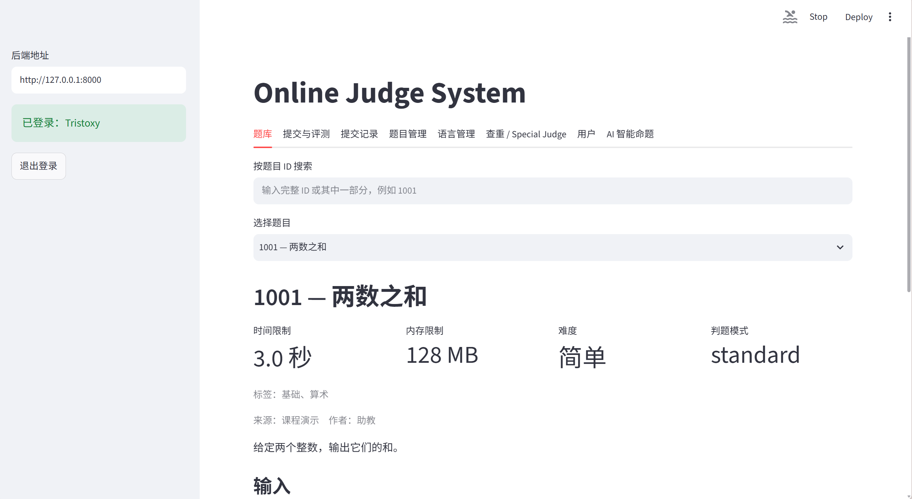

# oj-system-project

一个基于 **FastAPI + Streamlit** 的在线评测系统，支持题目管理、代码提交与评测、动态语言注册、用户权限、日志记录、代码查重以及可选的 AI 命题功能。

## 项目内容

- 题目、用户、提交记录管理
- 动态注册和管理评测语言
- Python / C++ 代码编译与评测
- 时间、内存和输出限制
- Standard Judge、Strict Judge 与 Special Judge
- 提交记录查询、测试点日志与重判
- 基于程序结构的 Python 代码相似度分析
- AI 辅助命题、进度查询与 Token 使用统计
- FastAPI 后端与 Streamlit Web 前端

## Web

系统提供题目浏览、代码提交、评测结果、语言管理、用户信息和系统管理等页面。



## 项目结构

```text
.
├── app/                # FastAPI 后端与核心业务逻辑
│   ├── api/            # API 路由
│   ├── core/           # 配置、权限及通用组件
│   ├── judge/          # 代码评测
│   ├── models/         # 数据模型
│   ├── plagiarism/     # 代码相似度分析
│   ├── repositories/   # 数据持久化
│   └── services/       # 业务逻辑
├── frontend/           # Streamlit Web 前端
├── tests/              # 自动化测试
├── docs/               # 项目截图
├── requirements.txt
├── requirements-dev.txt
└── requirements-frontend.txt
```

## 环境

需要 **Python 3.10+**。评测 C++ 代码时还需要安装 `g++`。

Windows 下可在项目根目录创建虚拟环境并安装依赖：

```bash
python -m venv .venv
.venv\Scripts\activate
python -m pip install -r requirements-dev.txt -r requirements-frontend.txt
```

## 运行

启动后端：

```bash
uvicorn app.main:app
```

启动前端：

```bash
streamlit run frontend/app.py
```

Web 页面：

```text
http://localhost:8501
```

API 文档：

```text
http://127.0.0.1:8000/docs
```

## 测试

```bash
python -m compileall -q app tests frontend
python -m pytest -q
git diff --check
```

项目同时配置了 GitHub Actions，在 push 或 Pull Request 时自动运行测试。
