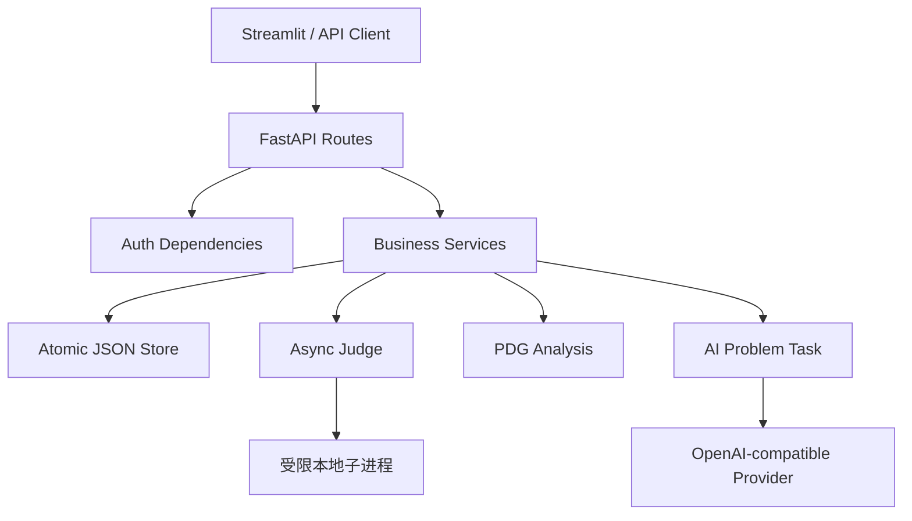

# 在线评测系统实验报告

> 姓名：[请填写]　学号：[请填写]　班级：[请填写]

## 1. 系统功能与设计

本项目实现了一个基于 FastAPI 的异步 Online Judge。基础部分包含题目配置、Python/C++
评测、语言注册、评测任务、用户与权限、日志审计、完整 Streamlit 前端和 JSON 持久化；
进阶部分按 2026 版要求实现了 AI 智能命题 R1–R4，并额外实现 Special Judge 和基于程序
依赖图的查重。

### 1.1 技术选型

| 技术 | 用途 | 选择原因 |
| --- | --- | --- |
| FastAPI + Pydantic | 异步 API 和参数模型 | 原生 `async def`，自动校验和 OpenAPI |
| asyncio | 后台评测与子进程 | 提交可立即返回 pending，不阻塞接口 |
| JSON + pathlib | 持久化 | 符合课程规模，数据可直接检查和导入导出 |
| psutil + resource | 本地资源限制 | 监控进程树并提供操作系统硬限制 |
| Streamlit | 前端 | 只用 Python 完成登录、展示、提交和查询 |
| httpx | AI 模型调用 | 异步请求 OpenAI 兼容服务，支持协程级真实中断 |
| ast + 图特征 | 代码查重 | 对变量改名和常量替换比纯文本更稳健 |

### 1.2 架构



路由层只处理 HTTP 输入输出；服务层实现业务规则；模型层负责字段校验；存储层集中处理锁、
深拷贝和原子写入；评测器与查重模块作为独立计算组件。该划分使权限、存储和执行逻辑可以
分别测试，也避免所有代码集中在 `main.py`。

## 2. 关键实现与难点

### 2.1 异步任务和状态流转

提交接口先原子创建 `pending` 记录，再用 `asyncio.create_task` 启动评测，因此响应一定包含
pending，而客户端可以继续查询。评测正常完成后，无论测例是 AC、WA、RE、CE、TLE 或
MLE，任务状态均为 `success`；只有评测基础设施异常才为 `error`。应用关闭会取消并等待
子进程，重启时会扫描和恢复未完成任务，重判则覆盖原 submission ID。

### 2.2 评测与资源限制

Python 直接解释执行，C++ 先编译后运行。每个测例使用独立输入并捕获输出；普通模式忽略
行末空格和末尾空行，strict 模式逐字符比较，SPJ 模式由脚本退出码决定。超时会终止整个
进程组；内存由 `psutil` 监控，并在 POSIX 系统用 `RLIMIT_AS` 设置硬上限；stdout/stderr
分别限制为 4 MiB，防止输出洪泛耗尽父进程内存。

时间与内存限制分别按“题目配置、语言配置、系统默认值”逐级解析，系统默认值为 3 秒和
128 MB。题目或语言没有显式配置时保存 `null`，到评测时才确定生效值。创建 submission 时
把当时的题目与语言写入内部快照；之后普通登录用户即使修改题目，也不会隐式重评或改变已经
排队/完成的记录。管理员主动 rejudge 才会刷新快照并使用最新配置。

评测命令不经过 shell，而是由 `create_subprocess_exec` 以参数数组启动；动态语言配置还会
检查可执行程序白名单、危险控制符和 `{src}`/`{exe}` 占位符。Linux 下为进程建立独立进程组，
命令结束、超时或取消时清理整个进程组，防止子进程脱离父进程继续运行。

### 2.3 认证、权限和异常优先级

密码使用随机 salt 的 PBKDF2-SHA256，不保存明文。登录后服务端保存随机 Session ID，
Cookie 只保存 ID。`Depends` 在业务参数处理前检查登录/管理员权限，使未登录的错误优先返回
401；服务层再按 403、400、429、409、404 的顺序检查。统一异常处理器把 Pydantic 的 422
转换为课程要求的 400，并保证 HTTP 状态码等于 JSON `code`。

### 2.4 持久化与导入事务

所有集合位于 `state.json`。写入时先生成临时文件，再使用同文件系统原子替换；读写通过
可重入锁串行化。导入先用嵌套 Pydantic 模型验证字段，再检查密码哈希、重复 ID/用户名、
分数和引用完整性，最后在一次锁内合并。导出严格排除内部 PDG 和 `created_at`，导入时为
官方格式中没有时间戳的历史 submission 设置不影响频率限制的旧时间。任何检查失败都不会
覆盖原文件；暂停的提交与查重任务会在导入结束或失败后恢复，ID 冲突时新数据覆盖旧数据。

### 2.5 AI 智能命题

每个登录用户可独立配置提供商 URL、模型名、密钥和输入/输出价格。密钥只保存在后端进程
内存中，不写入 JSON、日志或普通响应。创建任务后接口立即返回 pending，后台协程把状态
推进到 running；Streamlit 使用每秒刷新的独立片段持续展示进度，且中断按钮会实际取消后台
协程和进行中的 HTTP 请求。模型只允许返回单个 JSON 题目对象，后端再以 `ProblemCreate`
校验全部字段，校验通过后才进入题目管理表单供人工审阅和入库。系统读取模型返回的输入、
输出 Token，并按用户配置的计价单位与单价计算美元费用。

### 2.6 PDG 查重（额外功能）

Python 代码先解析 AST，再按 `if/else` 分支汇合、循环回边、异常分支和嵌套作用域构建语句级
CFG；随后使用固定点到达定义分析，连接变量定义—使用的数据依赖，并补充控制依赖形成 PDG。
变量名和常量被规范化。非 Python 代码使用规范化 token 图作为回退。相似度综合节点多重集合、
带端点标签的边集合和语句序列，并输出匹配节点及双方行号。PDG 随 submission 一起持久化；
报告先原子落盘，任务才变为 success，避免成功状态下文件尚不存在的竞态。

## 3. 成果展示与测试

自动测试覆盖：

- 题目字段、默认值、增删查和权限；
- 普通用户改题、完整测例可见性、改题不隐式重评和排队任务配置快照；
- 用户注册、密码、Session、banned、管理员和分页；
- Python/C++ 的 AC、WA、RE、CE、TLE、MLE、UNK；
- 频率限制、查询筛选、重判、统计和后台任务恢复；
- 日志内容裁剪、公开策略和成功/拒绝审计；
- reset、导出、导入、坏哈希、重复数据、断裂引用和重启持久化；
- AI 配置保密、任务权限、生成结果校验、真实中断和 Token/费用计算；
- SPJ 安全与执行、Linux 进程组清理、PDG 相似度和报告权限；
- 所有课程路由均为异步函数。

运行命令：

```bash
python -m compileall -q app tests frontend
python -m pytest -q
```

Windows 可用于日常开发，但课程最终包含 Linux 自动评测，因此提交前应在 WSL 或其他 Linux
环境补充运行测试，尤其确认 POSIX 进程组清理和 `RLIMIT_AS`。真实模型调用和 Streamlit 页面
截图仍需在本人电脑上人工验收，避免报告内容与现场演示不一致。

## 4. AI 使用说明

本项目允许 Vibe Coding。开发中使用 ChatGPT Codex 完成课程文档梳理、架构设计、主要代码
生成、边界测试、失败诊断、Git Conventional Commits 和文档草稿。工作流为：先读取课程
API/评分文档，检查已有代码；按基础、评测、进阶和工程化模块增量实现；每一批运行测试并
形成独立提交；最后以要求对照表复核。

AI 生成代码比例：[请按实际情况填写]。本人负责的工作包括：[请填写实际阅读、修改、运行、
前端演示和验收准备]。提交前已逐文件理解主要模块，并对 AI 输出进行了测试和人工
复核。课程文档和使用的开源库已在 README 与依赖文件中说明。

## 5. 总结与改进

项目的主要收获是理解异步 Web 接口、评测与 AI 任务状态机、子进程生命周期、权限优先级和
原子持久化之间的协作。若继续迭代，可把单文件 JSON 替换为数据库，把内存后台任务替换为
持久化队列，增加模型流式输出、自动测试数据验证和 CSRF 防护。

个人时间投入与反思：[请填写]。
