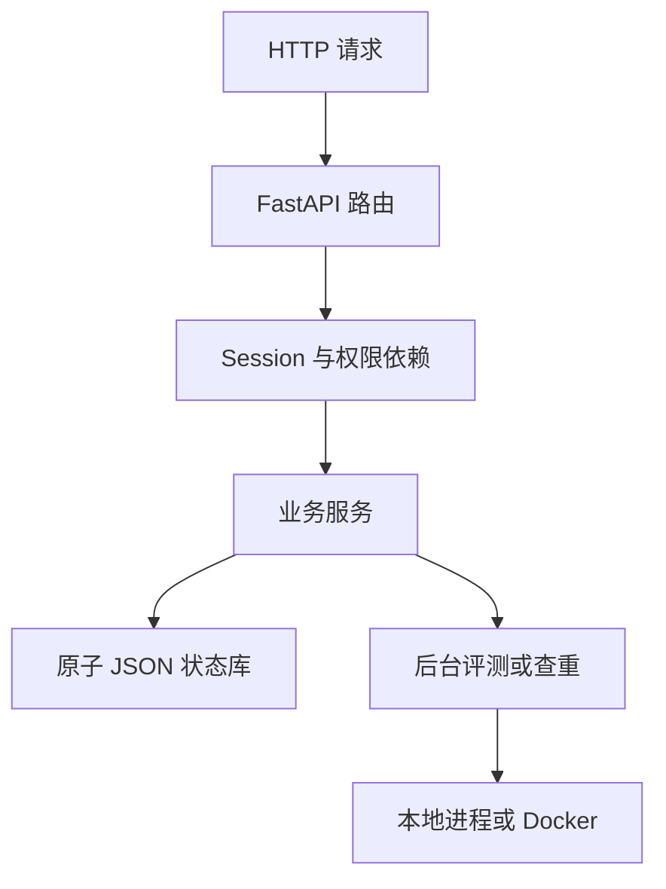
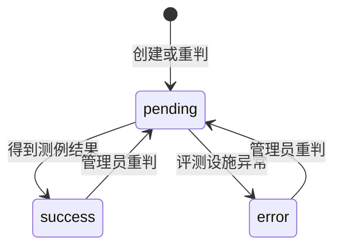

# 验收与答辩指南

这份指南用于最后打卡和快速理解项目。不要背代码；应能说明请求如何经过权限、服务、存储，
以及为什么评测必须放在后台任务和受限进程中。

## 一、十分钟演示顺序

1. 运行 `python -m pytest -q`，展示全部自动测试通过。
2. 启动后端并打开 `/docs`，说明所有课程路由都是 `async def`。
3. 用初始管理员登录并添加 A+B 题目，再以普通用户查看完整测例并修改题目。
4. 普通用户提交 Python AC、WA 和 TLE，说明接口先返回 pending。
5. 查询提交总分和评测日志，再切换 `public_cases` 展示详情裁剪。
6. 提交 C++，展示编译与运行两个阶段。
7. 导出 JSON、reset、重新登录并导入，展示数据恢复和 Session 清除。
8. 上传一个顺序无关 SPJ，提交不同输出顺序并通过。
9. 发起一次查重，展示相似度、节点映射和下载报告。
10. 在有 Docker 的 Linux/WSL 上展示 AC、TLE、MLE，并说明容器隔离参数。

## 二、请求链路



- `app/api/`：定义路径、接收参数、调用服务、返回统一响应。
- `app/dependencies.py`：在业务逻辑前完成登录和管理员检查。
- `app/services/`：实现重复检查、权限后的状态规则、分页、任务调度和导入事务。
- `app/repositories/state_store.py`：加锁、深拷贝、临时文件和原子替换。
- `app/judge/runner.py`：编译、执行、stdin/stdout、超时、内存、容器和结果分类。
- `app/plagiarism/pdg.py`：AST→CFG→PDG、到达定义和近似图匹配。
- `app/models/`：用 Pydantic 拒绝缺字段、错类型、额外字段和越界数据。

## 三、最常被问的设计问题

### 为什么提交接口不能等待评测结束？

接口先原子保存 pending submission，再用 `asyncio.create_task` 启动评测，所以响应快且任务可查询。
正常 AC/WA/TLE 等都属于评测成功完成，submission 状态为 success；只有评测设施故障才是 error。

### 401、403、400 为什么有固定优先级？

登录和角色使用 FastAPI 依赖先检查；Pydantic 再处理业务参数；服务层按频控、冲突和资源存在性
检查。这样无权限用户不能利用不同错误探测系统内部资源。

### JSON 如何避免写到一半损坏？

状态修改在可重入锁内完成，先把完整 JSON 写到同目录临时文件，再用原子 replace 替换正式文件。
导入先完整验证，验证通过后才合并；失败不会留下半份状态。

### CE、RE、TLE、MLE、UNK 如何区分？

- 编译命令失败为 CE。
- 程序非零退出且不是内存错误为 RE。
- 超过题目时间并被终止为 TLE。
- 超过地址空间/RSS/Docker 内存限制为 MLE。
- Docker、命令或输出上限等评测设施异常为 UNK。

### 题目和语言都能配置资源限制，以谁为准？

时间和内存两个字段分别按“题目、语言、系统默认”取第一个非空值，系统默认是 3 秒和
128 MB。字段为空会原样持久化，到评测时才解析，因此语言级配置不会被建题默认值遮蔽。

### 改题会不会改变旧提交？

不会。所有登录用户可修改普通题目字段，详情也会返回 `testcases`；submission 创建时冻结
题目和语言配置，之后改题既不触发隐式重评，也不改变排队或完成记录。只有管理员显式 rejudge
会刷新快照并使用最新配置。

### Docker 为什么还要唯一容器名？

只终止 `docker run` 客户端不一定终止容器。唯一名称允许超时、取消和输出洪泛时再执行容器清理；
`--interactive` 则保证测试输入真正传入容器程序。

### PDG 不是简单文本相似度吗？

不是。Python 代码先构建语句节点和 CFG 分支/循环边，再通过到达定义分析连接数据依赖，并加入
控制依赖。变量名和常量规范化后，简单改名不会绕过检查。相似度综合节点、边和语句序列特征。

## 四、关键状态机



## 五、提交前命令

```bash
python -m compileall -q app tests frontend
python -m pytest -q
git status
git log --oneline --decorate
```

Docker 环境另执行：

```bash
./scripts/build_judge_images.sh
OJ_JUDGE_BACKEND=docker uvicorn app.main:app
```

## 六、必须诚实说明的边界

- 本地评测有资源与进程清理，但不能隔离宿主文件和网络；不可信代码必须使用 Docker。
- JSON 锁只覆盖单个 API 进程，不应启动多个 Uvicorn worker 共同写同一个 `data/`。
- C++ 查重目前使用 token 图回退；Python 才有完整 AST→CFG→PDG。
- 这是课程项目，不含 HTTPS 终止、CSRF token、分布式队列或数据库事务。
- 当前开发环境没有 Docker daemon，最终报告应放入本人机器上的真实容器运行截图。
